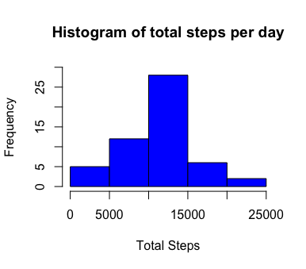
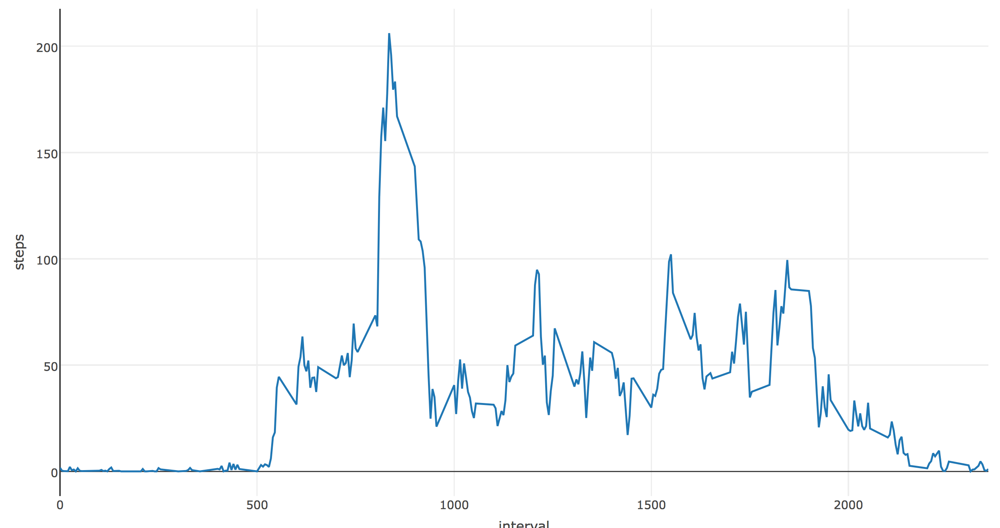
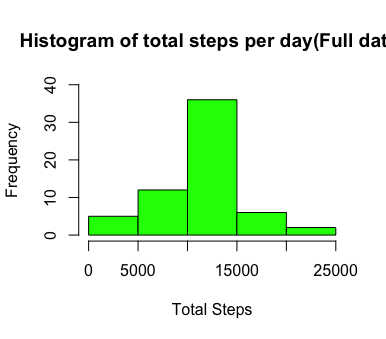

# Reproducible Research: Peer Assessment 1

## Loading and preprocessing the data

```r
unzip(zipfile = "activity.zip")
activity <- read.csv("activity.csv")
```


## What is mean total number of steps taken per day?
### Make a histogram of the total number of steps taken each day

```r
totalSteps <- aggregate(steps~date, data = activity, sum, na.rm = TRUE)
hist(totalSteps$steps, col = "blue",main = "Histogram of total steps per day", xlab = "Total Steps", ylim = c(0,30))

```

 

```r
mean(totalSteps$steps)
```

```
## [1] 10766.19
```

```r
median(totalSteps$steps)
```

```
## [1] 10765
```


## What is the average daily activity pattern?
### Make a time series plot (i.e. type = "l") of the 5-minute interval (x-axis) and the average number of steps taken, averaged across all days (y-axis)
```r
library(plotly)
averageSteps <- aggregate(steps~interval, data = activity,mean ,na.rm = TRUE)

plot_ly(averageSteps, x = ~interval) %>% add_trace(y = ~steps, name = 'Average steps',mode = 'lines')
```

 


Which 5-minute interval, on average across all the days in the dataset, contains the maximum number of steps?

```r
averageSteps[which.max(averageSteps$steps),]
```

```
##    interval    steps
##104      835 206.1698
```


## Imputing missing values

Calculate and report the total number of missing values in the dataset (i.e. the total number of rows with NAs)

```r
sum(is.na(activity$steps))
```

```
## [1] 2304
```

Devise a strategy for filling in all of the missing values in the dataset. The strategy does not need to be sophisticated. For example, you could use the mean/median for that day, or the mean for that 5-minute interval, etc.
Create a new dataset that is equal to the original dataset but with the missing data filled in.

```r
intsteps <- aggregate(steps~interval, data = activity,mean ,na.rm = TRUE)
NA_steps<- activity[is.na(activity$steps),]
num.Na <- length(NA_steps$steps)

full_steps <- data.frame(date=activity$date[is.na(activity$steps)], interval = activity$interval[is.na(activity$steps)],steps=intsteps[match(intsteps$interval,activity$interval[is.na(activity$steps)]),2])

temp_activity <- activity[!is.na(activity$steps),]

full_activity <- rbind(full_steps,temp_activity)
```

Make a histogram of the total number of steps taken each day and Calculate and report the mean and median total number of steps taken per day. Do these values differ from the estimates from the first part of the assignment? What is the impact of imputing missing data on the estimates of the total daily number of steps?

```r
filled_totalSteps <- aggregate(steps~date, data = full_activity, sum)
hist(filled_totalSteps$steps, col = "green",main = "Histogram of total steps per day(Full data)", xlab = "Total Steps", ylim = c(0,40))
```

 

```r
mean(filled_totalSteps$steps)
```

```
## [1] 10766.19
```

```r
median(filled_totalSteps$steps)
```

```
## [1] 10766.19
```

Mean is the same as the previous value. Median values are higher after imputing missing data. 
The reason isthat in the original data, there are some days with `steps` values `NA` for 
any `interval`. 
The total number of steps taken in such days are set to 0s by
default. However, after replacing missing `steps` values with the mean `steps`
of associated `interval` value, these 0 values are removed from the histogram
of total number of steps taken each day.

## Are there differences in activity patterns between weekdays and weekends?
Create a new factor variable in the dataset with two levels -- "weekday" and "weekend" indicating whether a given date is a weekday or weekend day.


```r
full_activity$date <- as.Date(full_activity$date)

weekend <- weekdays(as.Date(full_activity$date)) %in% c("Saturday", "Sunday")
full_activity$dayType <- "weekday"
full_activity$dayType[weekend == 'TRUE'] <- "weekend"

full_activity$dayType <- as.factor(full_activity$dayType)
```

Make a panel plot containing a time series plot (i.e. type = "l") of the 5-minute interval (x-axis) and the average number of steps taken, averaged across all weekday days or weekend days (y-axis). 

```r
intervel_steps <- aggregate(steps~interval+dayType, data = full_activity,mean,na.rm = TRUE)

week_p <- ggplot(intervel_steps, aes(x = interval, y = steps,color = dayType)) + ylab("Number of Steps") + ggtitle("Activity patterns between weekdays and weekends.")+ theme(plot.title = element_text(lineheight=.8, face="bold"))+geom_line() + facet_grid(dayType~.)

ggplotly(week_p)
```

 


